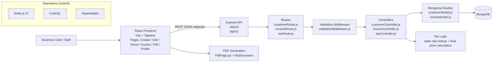

# InvoiceMe Architecture Overview

This document summarizes the current system architecture and the planned extension points.

## Current architecture

## System responsibilities

- Frontend: customer management, invoice workflow UI, PDF-ready views, responsive interactions
- API: versioned REST endpoints, validation, customer/invoice business logic, health checks
- Database: MongoDB persistence for customers, invoices, and business records
- Tax service: state tax lookup and calculation logic used during invoice processing
- CI/CD: automated workflow validation, security scanning, and dependency updates

## Planned extensions

- Redis / in-memory cache for repetitive reads and tax lookups
- AI-assisted development workspace with contextual prompts and agent guidance
- MailTo invoice delivery workflow for sending invoices directly to customer emails

## Diagram notes

The editable architecture drawing is stored in [architecture-overview.excalidraw](./architecture-overview.excalidraw).
