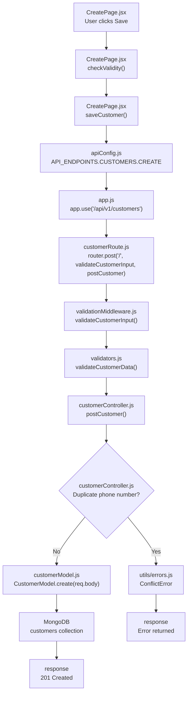
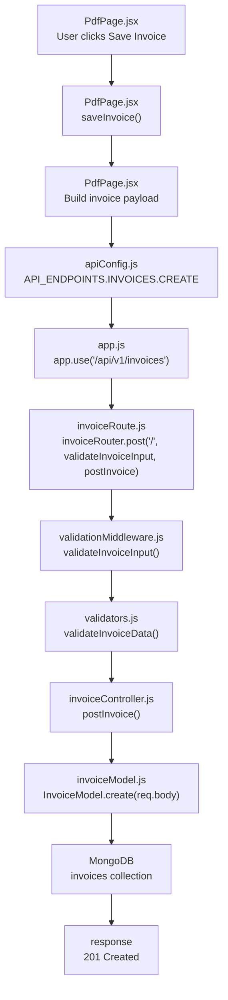

# InvoiceMe Save Execution Workflows

These diagrams trace the actual request path from the frontend save button through the API and into MongoDB.

## Customer Save Flow

## Final Invoice Save Flow from PDF Page

### Notes

- The customer save flow starts from the create form in CreatePage.jsx.
- The invoice save flow shown here is the final save triggered from the PDF preview page, using the payload prepared in PdfPage.jsx.
- Both flows follow the same application pattern: Frontend save handler → Axios request → Express route → Validation → Controller → Mongoose model → MongoDB.
